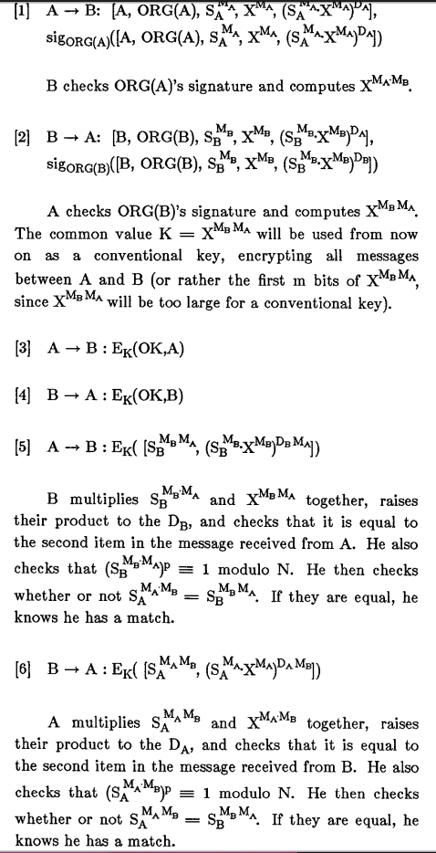
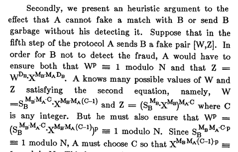

# [5] A More Efficient Cryptographic Matching Protocol for Use in the Absence of a Continuously Third Party

* protocol where users can verify whether they have matching credentials without revealing their credentials to each other unless there is a match

* consult a trusted third party may not be pratical in a highly distributed situation

* development of cryptographic matchmaking protocols

* Baldwin and Gramlich 1985 protocol
    - third party holds list of encrypted secrets and informs users whenever there is a match
    - to estrablish communication between users, they must first communicate to the third party
    - needs 18 separate messages to establish communication between 2 users which is too large to be practical

## Protocol
* based on the Diffie-Hellman for key exchange
    - A has a secret SA and B has SB
    - Both share a prime P and SA and SB are generators of the multiplicative group of ZP
    - A chooses a secret number MA and B chooses MB
    - A &rarr; B: SAMA
    - B &rarr; A: SBMB
    - A &rarr; B: SAMBMA
    - B &rarr; A: SBMAMB
* In this example B can falsify a match since he can send back the message from A in step 3
* A or B can verify the match without revealing to the other by adding garbage in the last step

## Use one way functions and signatures

* give A the triple [A, fA(SA), fA] cryptographically signed using private keys and where f is a one way function

* A and B exchange their triples and calculate fA(SB) and fB(SA)

* If a user gets another user's triple, he can use it to see who has a matching secret

* Use signatures to keep A and B honest in the steps 1 and 2; also keep A and B honest in the last 2 steps regarding on the difficulty of factoring large integers

### How it works
* all the organizations choose a integer N = (2pq + 1)(2r * 1) whee p,q and r are primes

* $\Phi$(N), the order of the multiplicative group of ZN, is 4pqr

* Choose a common generator X of the multiplicative group ZN

* Choose u such $u^{p}\equiv 1 mod N$ that can be done by choosing a generator v of the multiplicative group of ZN and letting $u = v^{4qr}$ 

* The knowledge of N's factorization is not used again so it can be destroyed

* The organization encrypts all possible secrets by representing each secret as an integer less than p can computing $u^a modulo N$

* Thus any encrypted secret S has the property $S^p \equiv 1 modulo N$. Each organization chooses its own public and private keys

* When A belonging to Org(A) signs up for the system, he receives N, p, SA and the public keys of all organizations in the system. He receives MA and DA and the tuple [A, ORG(A), SAMA, XAMA, (SAMA . XAMA)DA] where all exponentiations and multiplications are taken modulo N and signed with Organization A public key signature

* The tuple i sused to match user A secrets with other users while A keeps MA and DA secret

* If A and B wish to mactch secrets using this protocol;

### A cannot find the encrypted secret of B
* A knows SAMAMB and therefore knows SAMB since he can find MA-1 modulo p.

* A, in order to find MB he needs to find logarithms over ZN with respect to the base SA generator of the subgroup of order p of the multiplicative group of ZN

#### Heuristic Argument

* A must choose C so that XMAMB(C - 1).p $\equiv$ 1 modulo N
* Can only be achieved by choosing an integer C such (C - 1) % 4qr = 0
    - but if we knew 4qr he would know $\phi(N)$ = 4qr since he knows p.
    - If A knows $\phi(N)$ he would break any RSA cryptosystem

* If $\phi(N)$ is compromissed a user can find out if he has or not a match with another user

* A user can still detect fake matches
    - A user can use a tuple of fake secrets
    - These fake tuples can be used to initiate fake requests for matches

* If a fake tuple is matched is possible to detect the fraud 
* Fake tuples are no protection against users that only want to see who else matches his secret without letting them know

## Conclusion
* Creation of protocol that allows users to verify others credentials in the absence of third parties

* Problems
    - finding logarithms to the base S over ZB where $S^\mu \equiv 1 modulo N$
    - Factoring a large integer N when a large factor of $\phi(N)$ is known

* The efficiency of the protocol increases as the size of N decreases
* Obtain good estimates of what size N and p must be